<h1 style="text-align:center;">Arduino Components</h1>

<h2 style="text-align:center;">SEMICOLON</h2>
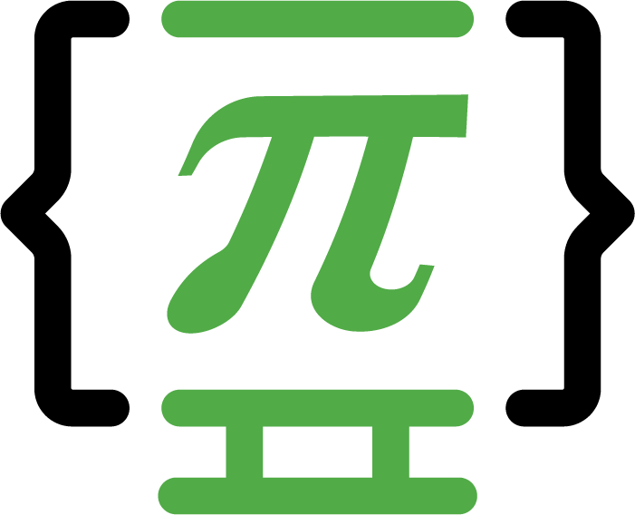
<h4 style="text-align:center;">Alor Setar, Kedah, Malaysia</h4>

<i>Ref no: Semicolon Tech/IoT/Arduino/Components-List-01<i>
 
<table>
<caption><b>Arduino Components List</b></caption>
<tr>
<th>SL No.</th>
<th>Hardware Name</th>
<th>Details/ Comments</th>
<th>Variation</th>
<th>Picture</th>
<th>Price (RM)</th>
<th>Stock/ Need</th>
</tr>
<tr>
<td>01</td>
<td>Arduino Board/ Microcontroller</td>
<td>UNO R3-SMD</td>
<td>Board + Cable</td>
<td>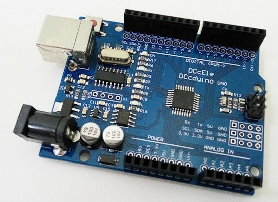</td>
<td>17.00</td>
<td></td>
</tr>
<tr>
<td>02</td>
<td>Arduino Board/ Microcontroller</td>
<td>DIP UNO R3</td>
<td>Board + Cable</td>
<td>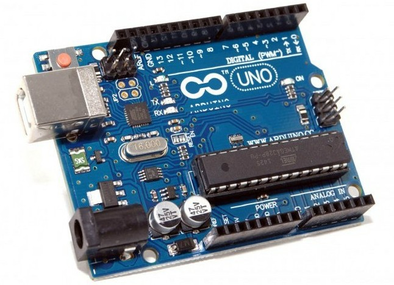</td>
<td>40.00</td>
<td></td>
</tr>
<tr>
<td>03</td>
<td>Soldering Iron</td>
<td>60 W Adjustable Temperature</td>
<td></td>
<td>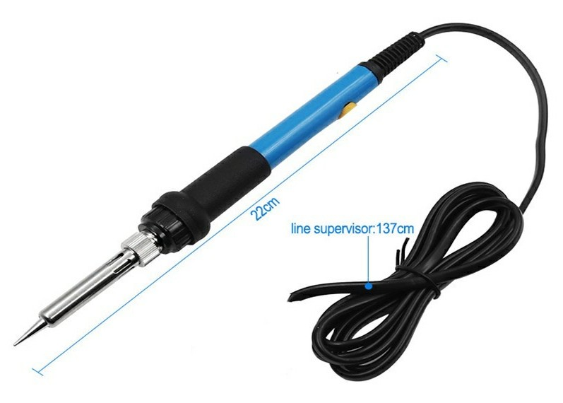</td>
<td>10.00</td>
<td></td>
</tr>
<tr>
<td>04</td>
<td>Soldering Wire</td>
<td></td>
<td></td>
<td>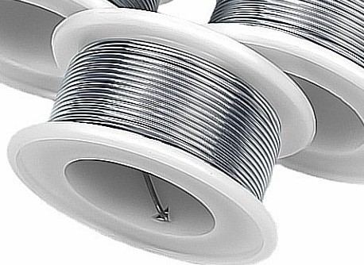</td>
<td>4.00</td>
<td></td>
</tr>
<tr>
<td>05</td>
<td>Glue Gun</td>
<td></td>
<td>Stick + Glue Gun</td>
<td>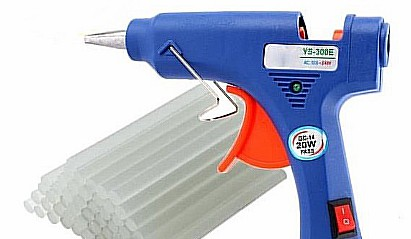</td>
<td></td>
<td></td>
</tr>
<tr>
<td>06</td>
<td>Battery Clip</td>
<td>9V</td>
<td>6 batteries Cover + Pin</td>
<td>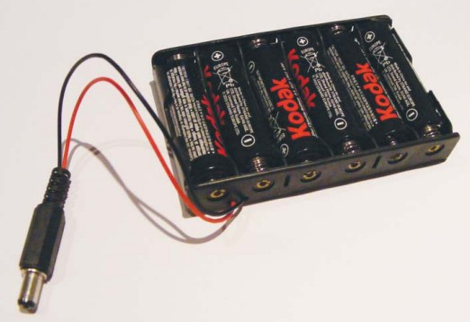</td>
<td>2.00+1.00</td>
<td></td>
</tr>
<tr>
<td>07</td>
<td>Breadboard</td>
<td>Solderless experiment</td>
<td>Full Size</td>
<td>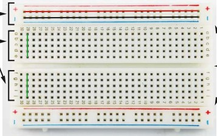</td>
<td>0.90~ 5.00</td>
<td></td>
</tr>
<tr>
<td>08</td>
<td>Jumper Wires</td>
<td>Make connection on the breadboard</td>
<td>* Male to Male
* Female to Male</td>
<td>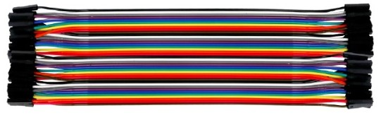</td>
<td></td>
<td></td>
</tr>
<tr>
<td>09</td>
<td>Resistors</td>
<td></td>
<td>330-ohm 330-ohm 

470-ohm 

10k-ohm

1M-ohm 
</td>
<td>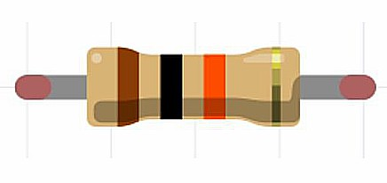</td>
<td></td>
<td></td>
</tr>
<tr>
<td>10</td>
<td>LED</td>
<td>red, green, yellow, blue</td>
<td>5 mm LED</td>
<td>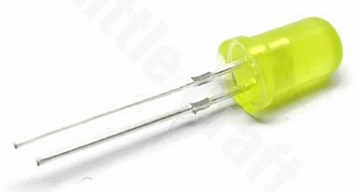</td>
<td></td>
<td></td>
</tr>
<tr>
<td>11</td>
<td>Potentiometer</td>
<td></td>
<td>50k-ohm</td>
<td>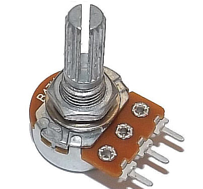</td>
<td></td>
<td></td>
</tr>
<tr>
<td>12</td>
<td>Momentary tactile four-pin pushbuttons</td>
<td></td>
<td></td>
<td>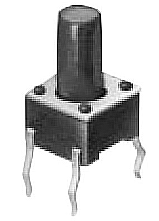</td>
<td></td>
<td></td>
</tr>
<tr>
<td>13</td>
<td>Hygrometer soil moisture sensor</td>
<td></td>
<td></td>
<td>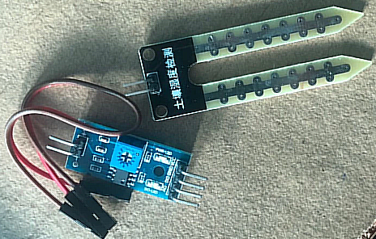</td>
<td></td>
<td></td>
</tr>
<tr>
<td>14</td>
<td>Piezo Buzzer</td>
<td>DIY Arduino</td>
<td>3V/ 5V</td>
<td>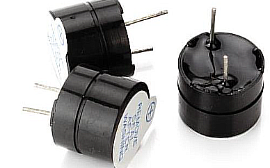</td>
<td></td>
<td></td>
</tr>
<tr>
<td>15</td>
<td>Servo Motor</td>
<td>Metal/ Plastic gear</td>
<td>180 deg/ 360 deg</td>
<td>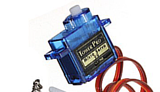</td>
<td></td>
<td></td>
</tr>
<tr>
<td>16</td>
<td>photoresistor (also known as a light resistor, or LDR)</td>
<td></td>
<td></td>
<td>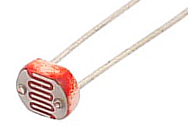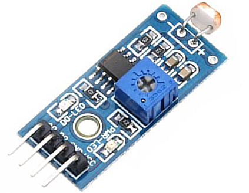</td>
<td></td>
<td></td>
</tr>
<tr>
<td>17</td>
<td>Joystick module</td>
<td></td>
<td>* One axis/ X axis
* Two axis/ X, Y axis</td>
<td>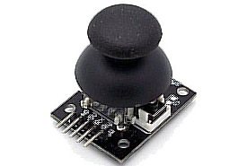</td>
<td></td>
<td></td>
</tr>
<tr>
<td>18</td>
<td>IR Remote control</td>
<td>Infrared receiver</td>
<td>VS183B</td>
<td>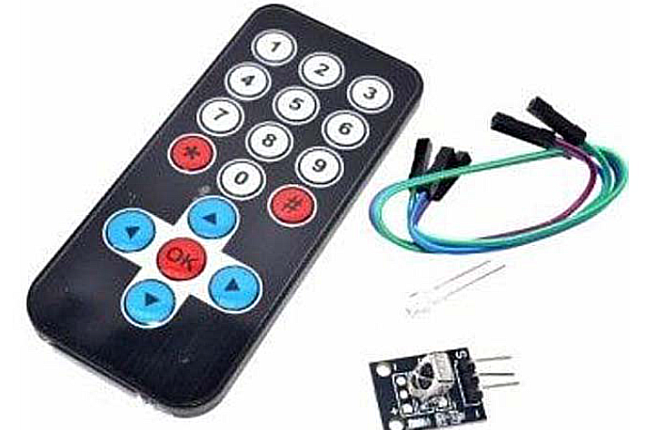</td>
<td></td>
<td></td>
</tr>
<tr>
<td>19</td>
<td>four-pin ultrasonic range sensor</td>
<td>To detect objects</td>
<td>hc-sr04</td>
<td>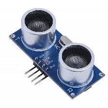</td>
<td></td>
<td></td>
</tr>
<tr>
<td>20</td>
<td>4 * 4 Matrix Array for Arduino</td>
<td></td>
<td>16 Key</td>
<td>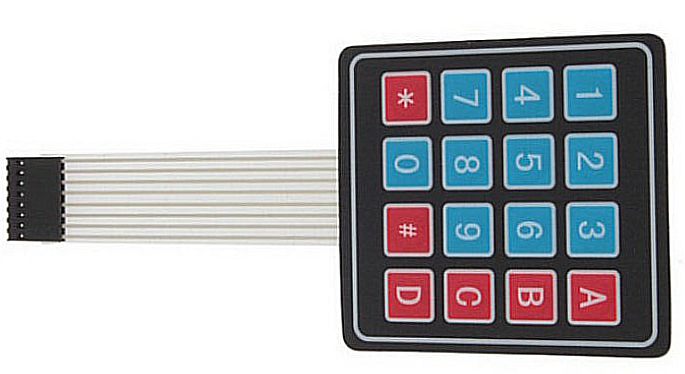</td>
<td></td>
<td></td>
</tr>
<tr>

</table>

SL No.	Hardware Name	Details/
Comments	Variation	Picture	Price (RM)	Stock/
Need
01	Arduino Board/
Microcontroller	UNO R3-SMD	Board + Cable	 	17.00	01
02	Arduino Board/
Microcontroller	DIP UNO R3	Board + Cable	 	40.00	
03	Soldering Iron	60 W
Adjustable Temperature		 	10.00	
04	Soldering Wire			 	4.00	
05	Glue Gun		Stick + Glue Gun	 		
06	Battery Clip	9V	6 batteries Cover + Pin

Or,
Alternative	 	2.00+
1.00	
07	Breadboard	Solderless experiment	Full Size

Half-Size

Mini	 	0.90
~ 5.00	
08	Jumper Wires	Make connection on the breadboard	Male to Male

Female to Male

	 		
09	Resistors		330-ohm 

470-ohm 

10k-ohm

1M-ohm 	 		
10	LED
	red, green, yellow, blue	
5 mm LED	 		
11	Potentiometer		50k-ohm	 		
12	Momentary tactile four-pin pushbuttons			 		
13	Hygrometer soil moisture sensor			 		
14	Piezo Buzzer	DIY Arduino	3V/ 5V	 		
15	Servo Motor	Metal/ Plastic gear

180 deg/
360 deg	SG90 9g	 		
16	photoresistor (also known as a light resistor, or LDR)			  		
17	Joystick module		One axis/ X axis

Two axis/
X, Y axis	 		
18	IR Remote control	Infrared receiver	VS183B	 		
19	four-pin ultrasonic range sensor	To detect objects	hc-sr04	 		
20	4 * 4 Matrix Array for Arduino		16 Key	 		
21	LED Display
LCD Display		LCD 1602/ 2004	 		
22	Seven Segment Display	LED Module	TM1637 	 		
23	Temperature and Humidity Sensor		DHT11	 		
24	Tilt Ball Switch					
25	8×8 rgb led matrix					
26	IR Obstacle avoidance Sensor	Car robot	3 pin/ 
4 pin	 		
27	IR Flame fire detector	Fire detecting robot	3 pin/4 pin	 		
28	Human Living Animal Motion Detect Detector Sensor		HC SR501 PIR(Passive infrared)	 		
29	RFID Card Reader Module		RC522
MFRC522	 		
30	IC Shift Register		74HC595	 		
31	Microcontroller Chip	Used in Arduino UNO board	ATMEL ATmega328p 	 		
32	16 MHz crystal oscillator (HC-495)			 		
33	Voltage Regulator	3 pin transistor	L7895CV 5V	 		
34	100uF Electrolytic Capacitor		50V/
25V/
16V	 		
35	9V Heavy Duty Battery		Battery + Battery Holder + Pin	 		
36	Buzzer Module		Active/
Passive	 		
37	Gearbox Motor	DIY/Arduino	Forward/
Reverse	 		
38	Mini Micro Dc Motor	DIY/Arduino	1220 Motor 3V9500 Rpm	 		
39	Mini DC motor	DIY/Arduino	3V, 1.3 A	 		
40	2 mm Plastic Wheel	DIY/Arduino		 		
41	Long Shaft Gear Motor	DIY/Arduino		 		
42	Double Shaft DC Motor	DIY/Arduino		 		
43	Mini DC Motor	DIY/Arduino		 		
44	Soil Moisture Hygrometer Detection Sensor	Arduino	Humidity Sensor	 		
45	Micro-speed Gear Motor	DIY/Arduino	30 rpm	 		
46	TT Motor 
Gear Motor	Arduino/DIY	130 Motor	 		
47	Gear Motor Wheel	Arduino Robot Car		 		
48	Snow/ Raindrop Detection Sensor			 		
49	Stepper Motor Driver	Speed Controller	L298N	 		
50	Mini Submersible Pump	Water Pump for various projects	3V~6V	 		
51	Mini Power Switch			 		
52						
53						
54						
55						
									Total Amount:		
			      About Me						         Contact Me
	S M Asiful Islam Saky
Founder,
SEMICOLON
Alor Setar, Kedah Malaysia	www.youtube.com/edu.semicolon
www.github.com/saky-semicolon
edu.semicolon@gmail.com

													Thank you….

