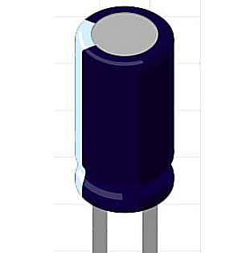

<!-- Arduino Components-List -->
<!-- Arduino, Electronics, Robotics, Sensors -->

<h1 style="text-align:center;"> Arduino Components - SEMICOLON </h1>

<i>Ref no: Semicolon Tech/IoT/Arduino/Components-List-01<i>
 
 

Arduino is an open-source electronics platform that consists of both hardware and software components. The platform is designed to make it easy for beginners and professionals alike to create interactive electronic projects. 
Remember that the specific components you need will vary depending on your project's requirements. Arduino's versatility allows you to build a wide range of projects, from simple LED blinking experiments to complex robotics and automation systems. Here are the main components of an Arduino setup:

<table>
<caption style="align:center;" ><b>Arduino Components List</b></caption>
<tr>
<th>SL No.</th>
<th>Hardware Name</th>
<th>Details/ Comments</th>
<th>Variation</th>
<th>Picture</th>
<th>Price (RM)</th>
<th>Stock/ Need</th>
</tr>
<tr>
<td>01</td>
<td>Arduino Board/ Microcontroller</td>
<td>UNO R3-SMD</td>
<td>Board + Cable</td>
<td></td>
<td>17.00</td>
<td></td>
</tr>
<tr>
<td>02</td>
<td>Arduino Board/ Microcontroller</td>
<td>DIP UNO R3</td>
<td>Board + Cable</td>
<td></td>
<td>40.00</td>
<td></td>
</tr>
<tr>
<td>03</td>
<td>Soldering Iron</td>
<td>60 W Adjustable Temperature</td>
<td></td>
<td></td>
<td>10.00</td>
<td></td>
</tr>
<tr>
<td>04</td>
<td>Soldering Wire</td>
<td></td>
<td></td>
<td></td>
<td>4.00</td>
<td></td>
</tr>
<tr>
<td>05</td>
<td>Glue Gun</td>
<td></td>
<td>Stick + Glue Gun</td>
<td></td>
<td></td>
<td></td>
</tr>
<tr>
<td>06</td>
<td>Battery Clip</td>
<td>9V</td>
<td>6 batteries Cover + Pin</td>
<td></td>
<td>2.00+1.00</td>
<td></td>
</tr>
<tr>
<td>07</td>
<td>Breadboard</td>
<td>Solderless experiment</td>
<td>Full Size</td>
<td></td>
<td>0.90~ 5.00</td>
<td></td>
</tr>
<tr>
<td>08</td>
<td>Jumper Wires</td>
<td>Make connection on the breadboard</td>
<td>* Male to Male
* Female to Male</td>
<td></td>
<td></td>
<td></td>
</tr>
<tr>
<td>09</td>
<td>Resistors</td>
<td></td>
<td>330-ohm 330-ohm 

470-ohm 

10k-ohm

1M-ohm 
</td>
<td></td>
<td></td>
<td></td>
</tr>
<tr>
<td>10</td>
<td>LED</td>
<td>red, green, yellow, blue</td>
<td>5 mm LED</td>
<td></td>
<td></td>
<td></td>
</tr>
<tr>
<td>11</td>
<td>Potentiometer</td>
<td></td>
<td>50k-ohm</td>
<td></td>
<td></td>
<td></td>
</tr>
<tr>
<td>12</td>
<td>Momentary tactile four-pin pushbuttons</td>
<td></td>
<td></td>
<td></td>
<td></td>
<td></td>
</tr>
<tr>
<td>13</td>
<td>Hygrometer soil moisture sensor</td>
<td></td>
<td></td>
<td></td>
<td></td>
<td></td>
</tr>
<tr>
<td>14</td>
<td>Piezo Buzzer</td>
<td>DIY Arduino</td>
<td>3V/ 5V</td>
<td></td>
<td></td>
<td></td>
</tr>
<tr>
<td>15</td>
<td>Servo Motor</td>
<td>Metal/ Plastic gear</td>
<td>180 deg/ 360 deg</td>
<td></td>
<td></td>
<td></td>
</tr>
<tr>
<td>16</td>
<td>photoresistor (also known as a light resistor, or LDR)</td>
<td></td>
<td></td>
<td></td>
<td></td>
<td></td>
</tr>
<tr>
<td>17</td>
<td>Joystick module</td>
<td></td>
<td>* One axis/ X axis
* Two axis/ X, Y axis</td>
<td></td>
<td></td>
<td></td>
</tr>
<tr>
<td>18</td>
<td>IR Remote control</td>
<td>Infrared receiver</td>
<td>VS183B</td>
<td></td>
<td></td>
<td></td>
</tr>
<tr>
<td>19</td>
<td>four-pin ultrasonic range sensor</td>
<td>To detect objects</td>
<td>hc-sr04</td>
<td></td>
<td></td>
<td></td>
</tr>
<tr>
<td>20</td>
<td>4 * 4 Matrix Array for Arduino</td>
<td></td>
<td>16 Key</td>
<td></td>
<td></td>
<td></td>
</tr>
<tr>
<td>21</td>
<td>LED Display/ LCD Display</td>
<td>LCD 1602/ 2004</td>
<td></td>
<td></td>
<td></td>
<td></td>
</tr>
<tr>
<td>22</td>
<td>Seven Segment Display</td>
<td>LED Module</td>
<td>TM1637</td>
<td></td>
<td></td>
<td></td>
</tr>
<tr>
<td>23</td>
<td>Temperature and Humidity Sensor</td>
<td></td>
<td>DHT11</td>
<td></td>
<td></td>
<td></td>
</tr>
<tr>
<td>24</td>
<td>Tilt Ball Switch</td>
<td></td>
<td></td>
<td></td>
<td></td>
<td></td>
</tr>
<tr>
<td>25</td>
<td>8×8 rgb led matrix</td>
<td></td>
<td></td>
<td></td>
<td></td>
<td></td>
</tr>
<tr>
<td>26</td>
<td>IR Obstacle avoidance Sensor</td>
<td>Car robot</td>
<td>3 pin/ 4 pin</td>
<td></td>
<td></td>
<td></td>
</tr>
<tr>
<td>27</td>
<td>IR Flame fire detector</td>
<td>Fire detecting robot</td>
<td>3 pin/4 pin</td>
<td></td>
<td></td>
<td></td>
</tr>
<tr>
<td>28</td>
<td>Human Living Animal Motion Detect Detector Sensor</td>
<td></td>
<td>HC SR501 PIR(Passive infrared)</td>
<td></td>
<td></td>
<td></td>
</tr>
<tr>
<td>29</td>
<td>RFID Card Reader Module</td>
<td></td>
<td>RC522 MFRC522</td>
<td></td>
<td></td>
<td></td>
</tr>
<tr>
<td>30</td>
<td>IC Shift Register</td>
<td></td>
<td>74HC595</td>
<td></td>
<td></td>
<td></td>
</tr>
<tr>
<td>31</td>
<td>Microcontroller Chip</td>
<td>Used in Arduino UNO board</td>
<td>ATMEL ATmega328p</td>
<td></td>
<td></td>
<td></td>
</tr>
<tr>
<td>32</td>
<td>16 MHz crystal oscillator (HC-495)</td>
<td></td>
<td></td>
<td></td>
<td></td>
<td></td>
</tr>
<tr>
<td>33</td>
<td>Voltage Regulator</td>
<td>3 pin transistor</td>
<td>L7895CV 5V</td>
<td></td>
<td></td>
<td></td>
</tr>
<tr>
<td>34</td>
<td>100uF Electrolytic Capacitor</td>
<td></td>
<td>50V/ 25V/ 16V</td>
<td></td>
<td></td>
<td></td>
</tr>
<tr>
<td>35</td>
<td>9V Heavy Duty Battery</td>
<td></td>
<td>Battery + Battery Holder + Pin</td>
<td></td>
<td></td>
<td></td>
</tr>
<tr>
<td>36</td>
<td>Buzzer Module</td>
<td></td>
<td>Active/ Passive</td>
<td></td>
<td></td>
<td></td>
</tr>
<tr>
<td>37</td>
<td>Gearbox Motor</td>
<td>DIY/Arduino</td>
<td>Forward/ Reverse</td>
<td></td>
<td></td>
<td></td>
</tr>
<tr>
<td>38</td>
<td>Mini Micro Dc Motor</td>
<td>DIY/Arduino</td>
<td>1220 Motor 3V9500 Rpm</td>
<td></td>
<td></td>
<td></td>
</tr>
<tr>
<td>39</td>
<td>Mini DC motor</td>
<td>DIY/Arduino</td>
<td>3V, 1.3 A</td>
<td></td>
<td></td>
<td></td>
</tr>
<tr>
<td>40</td>
<td>2 mm Plastic Wheel</td>
<td>DIY/Arduino</td>
<td></td>
<td></td>
<td></td>
<td></td>
</tr>
<tr>
<td>41</td>
<td>Long Shaft Gear Motor</td>
<td>DIY/Arduino</td>
<td></td>
<td></td>
<td></td>
<td></td>
</tr>
<tr>
<td>42</td>
<td>Double Shaft DC Motor</td>
<td>DIY/Arduino</td>
<td></td>
<td></td>
<td></td>
<td></td>
</tr>
<tr>
<td>43</td>
<td>Mini DC Motor</td>
<td>DIY/Arduino</td>
<td></td>
<td></td>
<td></td>
<td></td>
</tr>
<tr>
<td>44</td>
<td>Soil Moisture Hygrometer Detection Sensor</td>
<td>Arduino</td>
<td>Humidity Sensor</td>
<td></td>
<td></td>
<td></td>
</tr>
<tr>
<td>45</td>
<td>Micro-speed Gear Motor</td>
<td>DIY/Arduino</td>
<td>30 rpm</td>
<td></td>
<td></td>
<td></td>
</tr>
<tr>
<td>46</td>
<td>TT Motor/ Gear Motor</td>
<td>Arduino/DIY</td>
<td>130 Motor</td>
<td></td>
<td></td>
<td></td>
</tr>
<tr>
<td>47</td>
<td>Gear Motor Wheel</td>
<td>Arduino Robot Car</td>
<td></td>
<td></td>
<td></td>
<td></td>
</tr>
<tr>
<td>48</td>
<td>Snow/ Raindrop Detection Sensor</td>
<td></td>
<td></td>
<td></td>
<td></td>
<td></td>
</tr>
<tr>
<td>49</td>
<td>Stepper Motor Driver</td>
<td>Speed Controller</td>
<td>L298N</td>
<td></td>
<td></td>
<td></td>
</tr>
<tr>
<td>50</td>
<td>Mini Submersible Pump</td>
<td>Water Pump for various projects</td>
<td>3V~6V</td>
<td></td>
<td></td>
<td></td>
</tr>
<tr>
<td>51</td>
<td>Mini Power Switch</td>
<td></td>
<td></td>
<td></td>
<td></td>
<td></td>
</tr>
<tr>
<td>52</td>
<td></td>
<td></td>
<td></td>
<td></td>
<td></td>
<td></td>
</tr>
<tr>
<td>53</td>
<td></td>
<td></td>
<td></td>
<td></td>
<td></td>
<td></td>
</tr>
<tr>
<td>54</td>
<td></td>
<td></td>
<td></td>
<td></td>
<td></td>
<td></td>
</tr>
<tr>
<td>55</td>
<td></td>
<td></td>
<td></td>
<td></td>
<td></td>
<td></td>
</tr>
<tr>
<td colspan="5"><b><i>Total Amount:</i></b></td>
<td></td>
<td></td>
</tr>
<tr>
<td colspan="7"><b><i>Contributor:</i></b></td>
</tr>
<tr>
<td style="align:center;" colspan="7"><a href="https://github.com/saky-semicolon">S M Asiful Islam Saky</a>   Founder,   SEMICOLON   Alor Setar, Kedah, Malaysia <a href="mailto:edu.semicolon@gmial.com" > Send e-mail </a> </td>
</tr>
<tr>
<td colspan="7"><i>Thank you...</i></td>
</tr>
</table>

